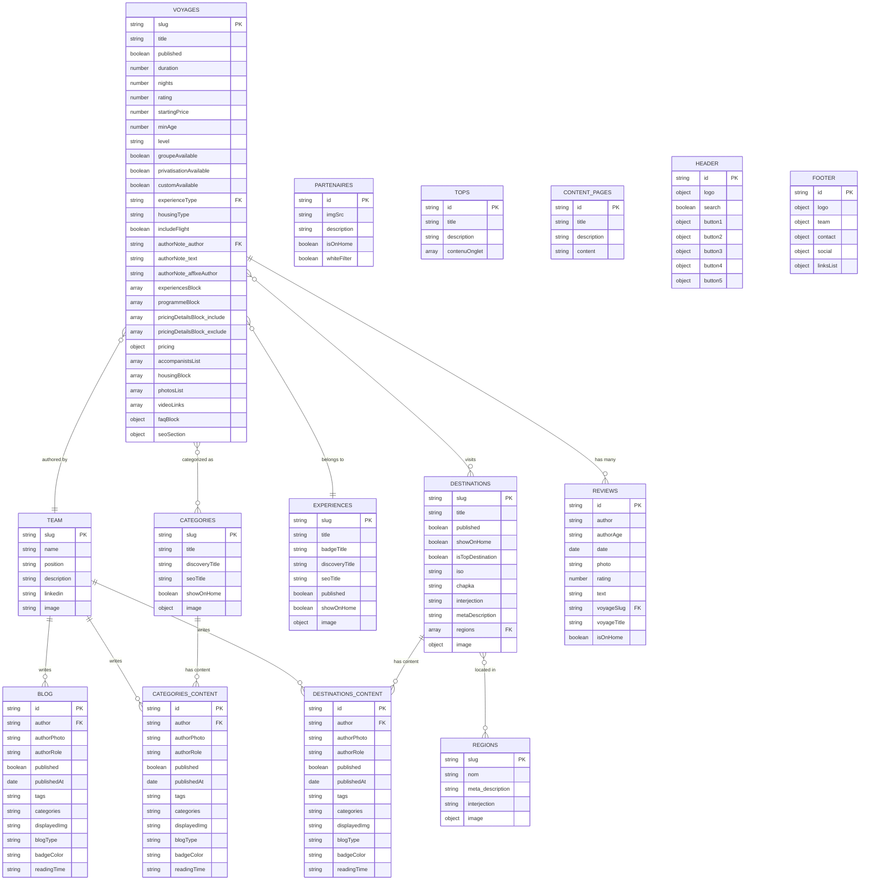

# Odysway Content Schema - Visual Diagram
https://www.mermaidchart.com/app/projects/5ef106a3-6bee-42f8-ada3-bfb6106a97b3/diagrams/7d853668-03e4-41f7-9c3a-f2af31393240/version/v0.1/edit
## Entity Relationship Diagram

## Key Relationship Types

### Many-to-Many Relationships
- **VOYAGES ↔ DESTINATIONS**: A voyage can visit multiple destinations, a destination can have multiple voyages
- **VOYAGES ↔ CATEGORIES**: A voyage can belong to multiple categories, a category can contain multiple voyages
- **DESTINATIONS ↔ REGIONS**: A destination can span multiple regions, a region can contain multiple destinations

### One-to-Many Relationships
- **VOYAGES → EXPERIENCES**: Each voyage has one primary experience type
- **VOYAGES → TEAM**: Each voyage has one author from the team
- **TEAM → BLOG**: A team member can write multiple blog posts
- **VOYAGES → REVIEWS**: A voyage can have multiple reviews

### Configuration Relationships
- **HEADER/FOOTER**: Global configuration entities
- **TEXTES**: Localization and UI text configuration
- **CONTENT_PAGES**: Markdown content pages

## Schema Compliance Notes

This diagram represents the exact relationships defined in `content.config.ts`:

1. **Dynamic Enum Generation**: All foreign key relationships use the dynamically generated enums from the config file
2. **Collection Types**: Data collections (JSON) vs Page collections (Markdown) are clearly distinguished
3. **Source Patterns**: File system patterns match the `source` definitions in the config
4. **Schema Validation**: All field types and constraints from Zod schemas are preserved
